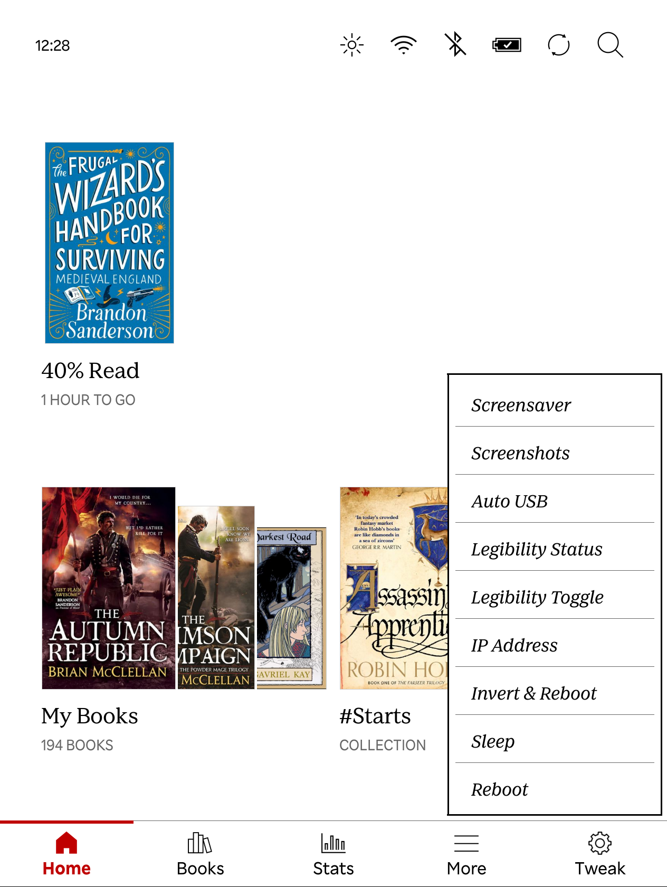

# My Custom Kobo Configuration

## What is this?

This repository helps you set up your Kobo just like I set up mine, which includes **some power user features**, and also some useful features. For example, support for **screensavers** and an **easy dark mode toggle** for when you're reading. Take a look!

<kbd></kbd>

### Tweaked tabs

> Less store, more of your books and stuff.

- My Books and My Notebooks are now **Books** and **Notes**.
- The Activity tab is now also visible as **Stats**.
- Notes and Discover tabs are **hidden** by default, but can be re-enabled.

### Custom menu items

> Power user stuff for typography lovers.

All of these live under the **Toggle** tab (the custom NickelMenu tab at the bottom of the home screen).

- **Screenshots**: Toggles taking screenshots with the power button. After taking screenshots, take care to remember to turn this back off...
- **Screensaver**: Toggles the screensaver by moving the `.kobo/screensaver` folder. The repository comes with a nice moon screensaver, but you can add your own.
- **Auto USB**: Toggles automatic USB connection. Helpful if you connect to your computer frequently, and don't want to keep approving the connection.
- **Typography**: Toggles Kobo's optimized WebKit text rendering, which enables ligatures and proper kerning in `kepubs`. Since this can cause issues with justified text, it's a toggle. Pairs with the [NickelTypeFix](https://github.com/nicoverbruggen/NickelTypeFix) mod (see [Recommended mods](#recommended-mods)) that fixes those rendering quirks. This will briefly reboot your device!
- **Minimal Home**: Toggles the home-screen content hiders (recommendations, suggestions, and the notices row) on or off. Reboots to apply.
- **Simple Tabs**: Toggles the simplified navigation tabs (see above) on or off, restoring the default Kobo tabs when off. Reboots to apply.
- **Invert Display**: Inverts the colors of the entire display and reboots the device.
- **Sleep Device**: Does the same as pressing the power button.
- **Reboot Device**: Does the same as pressing the power button for a few seconds.
- **Rescan books**: Forces a full rescan of your library (in the library menu).

### Reader & menu

- In the reader menu, a **Dark Mode** toggle has also been added. You can press the ... (ellipsis menu) to see this option when reading. (You no longer need to dig into settings to toggle this!)
- Added **customized fonts**.

## Installing via browser over USB (easiest)

If you've got Chrome, it's super easy.

1. You can visit [this website](https://kp.nicoverbruggen.be/) and use the **Connect my Kobo** feature, and select **Install or remove NickelMenu**. 

2. You can then select **Install NickelMenu & Apply Preset**. Check all the boxes for the complete experience.

3. Tell the webpage to **copy the files to your device**, **safely unplug** your device and **wait a bit**. When it restarts, you should be set!

This is made possible by my [KoboPatch Web UI](https://github.com/nicoverbruggen/kobopatch-webui). You can visit the project page to learn more about it. It was made for maximum convenience.

You can also use this webpage to **uninstall NickelMenu** if you don't like it.

## Installing NickelMenu

**If you aren't using the installation via the browser, you must first install NickelMenu. I repeat: NickelMenu must be installed for all of these changes to work correctly.** 

First, install the latest version of [NickelMenu](https://pgaskin.net/NickelMenu/). Keep in mind that you will need at least version 0.6 of NickelMenu installed in order to have customized menu items.

To install NickelMenu, copy `.kobo/KoboRoot.tgz` to the `.kobo` folder on your Kobo, and let your e-reader reboot. (It should tell you that it's installing an update and reboot.)

## Manual Setup

Before you begin, make sure to show hidden files and folders in your file manager, because the `.adds` and `.kobo` folders are hidden by default.

### Installing menu items

Copy the `.adds` directory to the root of your `KOBOeReader` volume. This is the configuration for NickelMenu.

### Fonts

Copy the `fonts` directory and any extra fonts you like over. 

If you like what you're seeing, you can find [more fonts](https://github.com/nicoverbruggen/ebook-fonts/releases) in my other repository.

(I recommend getting the Kobo Core fonts, since this repository only includes a Kobo-optimized version of Readerly.)

### Screensaver

You can copy the screensaver from `.kobo/screensaver` into the same folder on your Kobo device.

**You can also add your own screensavers.** If you add any additional `.png` or `.jpg` files to the `.kobo/screensaver` folder, you will randomly get an image each time you put your device to sleep. Nice, right?

You can toggle this feature via the **Toggle** tab (the custom NickelMenu tab at the bottom of the home screen), which lets you swap between viewing the book cover or the custom images you want. Useful for when you like seeing only your favorite covers...

> [!TIP]
> Keep in mind that you need to have the setting to display a book cover on. You can check it via **More > Settings > Energy saving and privacy > Show current read**, which must be set to "On".

## Additional tweaks

### Separating Kobo and KOReader libraries

You tend to have the best experience if your Kobo doesn't scan certain directories! Important if you want to use KOReader or store other files that you don't want to appear in your library as "books".

To do this, add the following block to the `.kobo/Kobo/Kobo eReader.conf` file:

```
[FeatureSettings]
ExcludeSyncFolders=(calibre|\\.(?!kobo|adobe|calibre).+|([^.][^/]*/)+\\..+)
```

**After doing this, disconnect your device and reboot it to apply this configuration tweak! After rebooting, you can copy over files to the `calibre` directory.**

(This particular configuration ensures that a root-level `calibre` folder won't be scanned by Kobo's operating system. This essentially keeps the Calibre books separate from the Kobo books.)

### Hiding home screen content

In my screenshot above, I've hidden some rows on the home screen. This is now **part of the preset**. The `.adds/nm/webui-preset` file ships with these flags enabled:

```
experimental:hide_home_row1col2_enabled:1
experimental:hide_home_row2col2_enabled:1
experimental:hide_home_row3_enabled:1
```

You can flip all of them on or off at any time from the **Minimal Home** item in the Toggle menu. These flags require my [NickelMenu fork](https://github.com/nicoverbruggen/NickelMenu/releases) (v1.1 or newer); check the [release notes](https://github.com/nicoverbruggen/NickelMenu/releases) for the full list of available options.

**You will need to reboot your device for these changes to be applied**, as the home screen elements are hidden when NickelMenu hooks into the system. (The Minimal Home toggle reboots for you.)

## Recommended mods

These aren't included in this repository, but they pair really well with this setup.

### NickelTypeFix

[NickelTypeFix](https://github.com/nicoverbruggen/NickelTypeFix) is recommended if you use the **Typography** toggle.

Enabling that toggle (Kobo's optimized WebKit text rendering) exposes a couple of rendering quirks: uneven justification and vertical CJK text. NickelTypeFix repairs those, so you get proper ligatures and kerning without the downsides.

It also fixes a separate bug in Kobo's text renderer that causes an uneven baseline on unhinted fonts. This one is unrelated to the WebKit override.

The [web installer](https://kp.nicoverbruggen.be/) can install it for you automatically as part of the "Better typography and fixes" option.

### NickelHome

[NickelHome](https://github.com/nicoverbruggen/nickelhome) hides rows of content on the home screen (recommendations, suggestions, and the notices row). This is the same feature this preset uses via the **Minimal Home** toggle (see [Hiding home screen content](#hiding-home-screen-content)).

This preset relies on my NickelMenu fork for it. If you'd rather not install the fork, NickelHome does the same thing as a standalone mod, and runs alongside the stable version of NickelMenu (it doesn't require NickelMenu at all).

Note that it uses its own config file, so the Minimal Home toggle won't control it.
